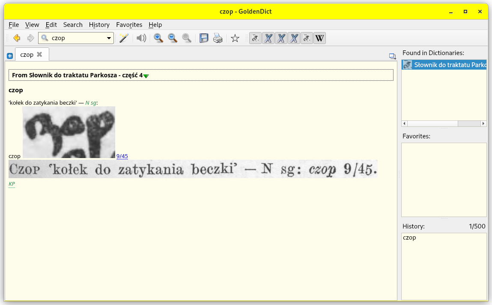
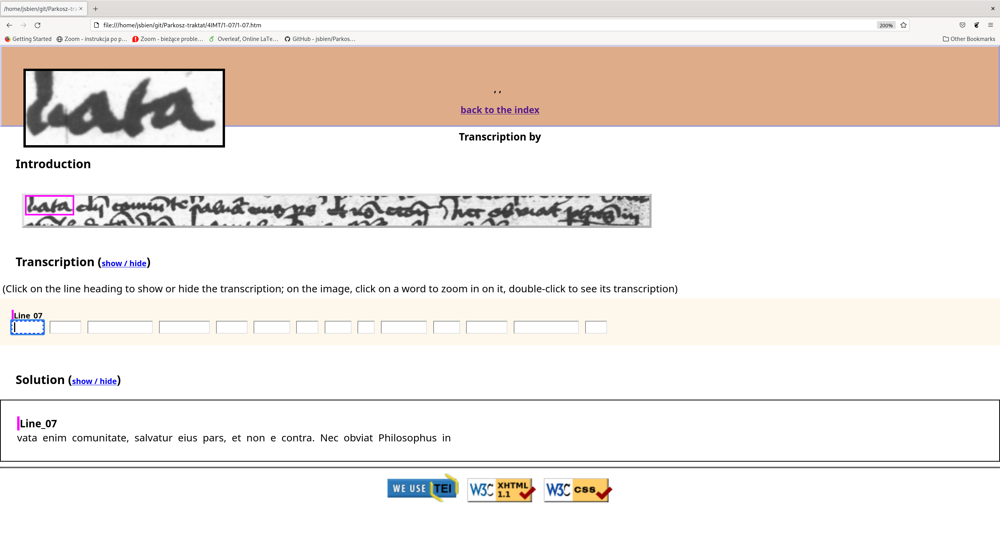

Traktat - the treatise:

https://jsbien.github.io/Parkosz4IIIF

**Kucała, Marian (1985) Jakuba Parkosza traktat o ortografii polskiej. Państwowe Wydawnictwo Naukowe.**

Podstawowy adres dygitalizacji - The primary address

http://ebuw.uw.edu.pl/publication/220504

**Zawartość niniejszego repozytorium - Content of the repository**

Oryginalne skany traktatu - original scans of the treatise.

Skany w formacie DjVu z OCR - *OCRed scans in DjVu format*

Fragmenty książki skonwertowane na LuaLaTeX, wersja wstępna z licznymi usterkami.

*Quick and dirty LuaLaTeX fragments of the book with several technical problems.*

Skany z transkrypcją są dostępne również w systemie Transkribus (https://transkribus.eu) -
Scans with transcription are also available in Transkribus system (https://transkribus.eu).

*Zadania studenckie dotyczące traktatu - students term assignments related to the treatise*

GoldenDict:	    

IMT:

